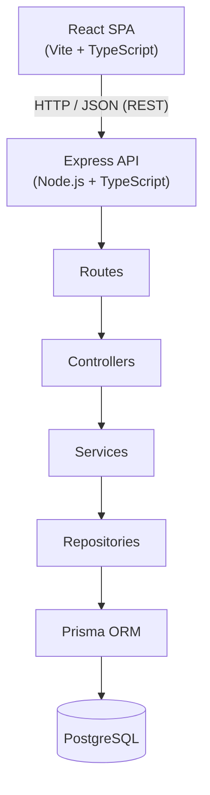
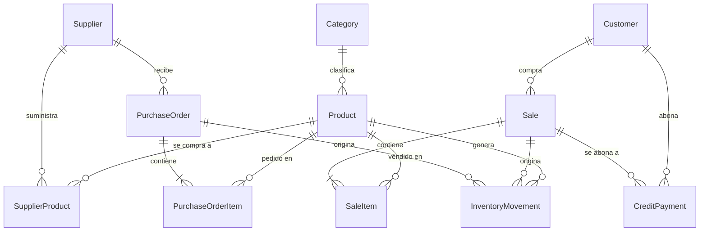
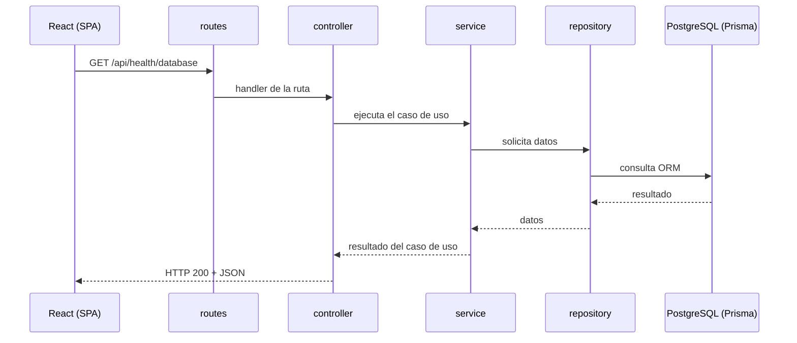

# Arquitectura — SC702-G4-MiniSuper

Sistema de gestión para minisúper / abastecedor **Nuevo Amanecer**.
Curso **SC-702 — Diseño y Desarrollo de Sistemas**, **Grupo 4**.

Este documento describe **la base arquitectónica** del proyecto: cómo está organizado el
código, qué responsabilidad tiene cada capa y cómo se agrega una funcionalidad nueva.
Las historias de usuario (HU) se implementan **encima** de esta base.

---

## 1. Contexto y alcance

| Punto | Definición |
| --- | --- |
| Usuario del sistema | **Un único dueño** del negocio (no hay múltiples roles ni multi-tenant) |
| Uso de IA | El sistema **NO** incluye asistentes de inteligencia artificial |
| Tipo de aplicación | Aplicación web cliente-servidor (SPA + API REST) |
| Historias de usuario | 30 HU (`HU-01` … `HU-30`) agrupadas en 3 módulos funcionales |

### Los 3 módulos funcionales

| Módulo | Dominio | Historias |
| --- | --- | --- |
| **Módulo 1** | Productos e inventario | HU-01 … HU-10 |
| **Módulo 2** | Acceso, ventas y clientes | HU-11 … HU-20 |
| **Módulo 3** | Proveedores, pedidos y reportes | HU-21 … HU-30 |

La arquitectura debe poder soportar los 3 módulos sin reorganizaciones: por eso el backend
trabaja por **capas** (routes → controllers → services → repositories) y el frontend por
**features**.

---

## 2. Vista general



Regla central de la arquitectura: **cada capa solo conoce a la capa inmediatamente
inferior**. Un `controller` nunca llama a Prisma directamente; siempre pasa por `service` y
`repository`.

---

## 3. Frontend

* **Tecnología**: React + Vite + TypeScript (SPA).
* **Ruteo**: React Router con rutas declarativas (`BrowserRouter` + `Routes`) en
  `frontend/src/app/routes.tsx`. `/login` se renderiza fuera del layout; el resto
  de pantallas comparte `MainLayout` a través de `<Outlet />`.
* **Comunicación HTTP**: centralizada en `frontend/src/services/`. Ningún componente
  ejecuta `fetch` directamente.
* **URL del backend**: variable de entorno `VITE_API_URL`, leída una sola vez en
  `frontend/src/config/env.ts` (ver `frontend/.env.example`).

```
frontend/src/
├── app/          Arranque de la app: App.tsx (router) y routes.tsx (definición de rutas)
├── components/   Componentes de UI genéricos y reutilizables (sin lógica de negocio)
├── config/       Lectura tipada de variables de entorno (env.ts)
├── features/     Un folder por dominio (products, sales, suppliers...):
│                 componentes + hooks + estado propio de esa funcionalidad.
│                 Se llena al implementar las HU (ver src/features/README.md)
├── layouts/      Marcos visuales que envuelven páginas (MainLayout)
├── pages/        Una página por ruta. Componen features/components, sin lógica de negocio
├── services/     Único lugar con acceso HTTP (api-client.ts + *.service.ts)
├── styles/       Estilos globales (CSS plano)
├── types/        Tipos compartidos de TypeScript (contratos de la API)
└── main.tsx      Monta React en el DOM
```

### Flujo de datos en el frontend

```
Page → feature (hook/componente) → services/*.service.ts → services/api-client.ts → HTTP
```

Cuando se implemente un módulo se espera, por ejemplo:

```
features/products/
├── ProductTable.tsx     (componente de la feature)
├── ProductForm.tsx
├── use-products.ts      (hook: estado + llamadas al servicio)
└── product.types.ts     (tipos propios de la feature)

services/product.service.ts  -> usa api-client.ts y devuelve datos tipados
```

---

## 4. Backend

* **Tecnología**: Node.js + Express + TypeScript.
* **Prefijo de API**: `/api`.
* `app.ts` configura Express (middlewares, rutas, manejo de errores).
* `server.ts` levanta el servidor HTTP (es el único que hace `listen`).

```
backend/src/
├── app.ts         Configura Express (helmet, cors, json, rutas, errores) y exporta la app
├── server.ts      Inicia el servidor HTTP usando app.ts y cierra conexiones al apagar
├── config/        Variables de entorno validadas (env.ts) y cliente Prisma (prisma.ts)
├── routes/        Define endpoints y los asocia a controllers (sin lógica)
├── controllers/   Reciben el request, usan validadores, llaman services y arman la response
├── services/      Lógica de negocio y coordinación de operaciones
├── repositories/  Acceso a datos. Únicos que usan Prisma para operaciones del dominio
├── validators/    Esquemas Zod de entrada por recurso (ver src/validators/README.md)
├── middleware/    Middlewares transversales: manejo de errores y 404
├── utils/         Utilidades puras y errores HTTP (HttpError)
└── generated/     Cliente Prisma generado (`prisma generate`). No se versiona
```

### Responsabilidades por capa (contrato del equipo)

| Capa | Sí hace | No hace |
| --- | --- | --- |
| `routes` | Declarar método + ruta y delegar al controller | Lógica, validaciones, acceso a datos |
| `controllers` | Leer `req` (params/query/body), llamar al service, elegir status code y forma de la respuesta | Reglas de negocio, consultas a Prisma |
| `services` | Reglas de negocio, coordinación, cálculos (totales, deudas, ganancias) | Hablar HTTP (`req`/`res`), Prisma directo |
| `repositories` | Consultas y escrituras con Prisma | Reglas de negocio, HTTP |
| `validators` | Validar/normalizar la entrada con Zod antes del controller | Reglas de negocio |
| `middleware` | Aspectos transversales: errores, 404, logging | Lógica de un módulo |

### Manejo de errores

* `utils/http-error.ts` expone `HttpError` (status code + mensaje + detalles opcionales)
  para errores esperados, con fábricas `badRequest`, `unauthorized`, `forbidden`,
  `notFound`, `conflict` y `externalService`.
* `middleware/error-handler.middleware.ts` centraliza **todas** las respuestas de error con
  una forma JSON estable (`details` solo se incluye cuando hay algo que mostrar):

```json
{
  "error": {
    "message": "Los datos enviados no son válidos.",
    "details": { "price": ["Debe ser mayor que 0"] }
  }
}
```

* El manejador distingue tres casos: `ZodError` → `400` con el detalle por campo;
  `HttpError` → el status code que trae el error; cualquier otro error → `500`, se
  registra completo en la consola del servidor y al cliente solo le llega un mensaje
  genérico (en desarrollo se añade `details` con la causa para depurar).
* Express 5 propaga automáticamente los rechazos de promesas `async` al manejador de
  errores; por eso los controllers pueden ser `async` sin envoltorios tipo `asyncHandler`.
* `middleware/not-found.middleware.ts` responde 404 en formato JSON para rutas inexistentes.
* `server.ts` además hace apagado ordenado: en `SIGINT`/`SIGTERM` deja de aceptar
  peticiones, cierra el pool de Prisma y termina el proceso (con corte forzado a los 10 s).

### Endpoints de infraestructura

| Método | Ruta | Descripción |
| --- | --- | --- |
| `GET` | `/api/health` | Estado del servicio: `{ "status": "ok" }`. No toca la base de datos |
| `GET` | `/api/health/database` | Verifica la conexión con PostgreSQL vía Prisma (`repository`) |

`/api/health/database` demuestra el flujo completo `route → controller → service →
repository → Prisma`. Responde `200` si la base responde y `503` si no.

---

## 5. Base de datos y Prisma

* **Motor**: PostgreSQL.
* **ORM**: Prisma (`backend/prisma/schema.prisma`).
* **Cliente Prisma**: instanciado una sola vez en `backend/src/config/prisma.ts`.
* Los `services` **no** importan Prisma: solo los `repositories`.

### Decisiones de modelado

1. **Dinero con `Decimal`** (`Decimal(12, 2)`). Nunca `Float`: evita errores de redondeo en
   precios, costos, totales y pagos.
2. **Identificadores `UUID`** (`String @id @default(uuid())`) en todas las entidades.
3. **Baja lógica, no borrado físico**, en productos, categorías, clientes y proveedores
   (`isActive`). El historial de ventas no debe perder información (HU-03).
4. **`SupplierProduct`** (tabla intermedia) guarda `unitCost` por proveedor: un producto
   puede comprarse a varios proveedores y el costo se compara entre ellos.
5. **`SaleItem` guarda `unitPrice` y `unitCost` como "foto" del momento de la venta**, para
   que el reporte de ganancias (HU-29) no dependa del costo actual del producto.
6. **El stock vive en `Product.stock`** (permite comparar contra `minStock` sin agregaciones)
   y **todo cambio de stock debe generar un `InventoryMovement`** (`stockBefore`/`stockAfter`)
   para dejar historial auditable (HU-10, HU-16).
7. **Las alertas no se almacenan**: son derivables del dominio (`stock <= minStock`,
   vencimiento cercano, deuda > 0). Guardarlas duplicaría estado y podría desincronizarse.
8. **La deuda de un cliente (fiado) no se guarda como saldo**: se **deriva** de las `Sale`
   con `paymentMethod = CREDIT` menos los `CreditPayment` de ese cliente. Así HU-18 ("se
   acumula la deuda") y HU-19 ("la deuda se actualiza o se marca como saldada") se cumplen
   manteniendo un historial de movimientos en lugar de un número que puede descuadrar.
9. **Sin roles ni RBAC**: existe un único dueño (`User`); no se modelan permisos.
10. **Sin columna `createdBy`/autor en ventas, movimientos ni pedidos**: el sistema es
    monousuario (HU-12), así que el autor no aporta información. Si algún día hay más de
    un usuario, se agrega con una migración y no rompe lo existente.
11. **Sin folios correlativos** (`invoiceNumber`, `orderNumber`): ninguna historia los
    pide. El ticket de caja y el PDF del pedido (HU-24) pueden usar el `id` y la fecha;
    si el dueño los pide, se añade un correlativo anual con su propia migración.
12. **Sin campos de descuento ni de anulación de ventas**: HU-17 solo pide elegir
    efectivo o tarjeta, y las 30 historias no contemplan borrar una venta. Modelarlos
    ahora sería inventar requisitos.
13. **`PurchaseOrderStatus` solo tiene `PENDING` y `RECEIVED`**: los estados de un enum
    también son requisitos. `receivedQuantity` en `PurchaseOrderItem` permite, en cambio,
    recepciones parciales sin crear una entidad extra (HU-22 habla de "entregas").



`User` aparece sin relaciones en el diagrama a propósito: es la cuenta única de acceso
(HU-11 … HU-15) y, al no haber múltiples usuarios, ninguna transacción necesita
referenciarla (decisión 10).

### Modelo de dominio y su origen en las HU

| Entidad | Para qué existe (HU relacionadas) |
| --- | --- |
| `User` | Cuenta única del dueño: login, perfil, recuperación (HU-11 … HU-15) |
| `Category` | Categorizar y filtrar inventario (HU-04) |
| `Product` | Código, código de barras, precios, costo, stock, stock mínimo y vencimiento (HU-01 … HU-09) |
| `InventoryMovement` | Historial auditable de entradas, salidas y ajustes (HU-10, HU-16) |
| `Supplier` / `SupplierProduct` | Proveedores, productos que suministran y su costo (HU-01, HU-21) |
| `Customer` | Clientes y sus fiados (HU-18, HU-19, HU-30) |
| `Sale` / `SaleItem` | Ventas con varios ítems, método de pago y ganancia histórica (HU-16 … HU-20, HU-28, HU-29) |
| `CreditPayment` | Abonos a fiados (HU-19, HU-30) |
| `PurchaseOrder` / `PurchaseOrderItem` | Pedidos a proveedores e historial de compras (HU-22 … HU-24) |

---

## 6. Flujo HTTP / JSON de una petición



---

## 7. Variables de entorno

Tres archivos `.env` con propósitos distintos. Todos tienen su `.env.example`
versionado; ninguno se sube a Git.

| Archivo | Lo lee | Variables |
| --- | --- | --- |
| `.env` (raíz) | `docker-compose.yml` | `POSTGRES_USER`, `POSTGRES_PASSWORD`, `POSTGRES_DB`, `POSTGRES_PORT` |
| `backend/.env` | `backend/prisma7.config.ts` (CLI de Prisma) y `backend/src/config/env.ts` (API) | `PORT`, `NODE_ENV`, `CORS_ORIGIN`, `DATABASE_URL` |
| `frontend/.env` | Vite a través de `frontend/src/config/env.ts` | `VITE_API_URL` |

Puntos que conviene tener claros:

* **Prisma 7 no carga `.env` automáticamente.** Lo hace `prisma7.config.ts` con
  `import 'dotenv/config'`, y el propio backend lo hace en `src/config/env.ts`.
  Ese archivo es, además, el nuevo nombre del archivo de configuración de Prisma
  (`prisma.config.ts` sigue funcionando como nombre legado).
* **La cadena de conexión está en dos lugares y debe coincidir**: `prisma7.config.ts`
  (para la CLI: migraciones, Studio) y `src/config/prisma.ts` (para la aplicación,
  a través del adaptador `@prisma/adapter-pg`). En `schema.prisma` ya no va.
* `env.ts` valida con Zod en el arranque: si falta `DATABASE_URL`, el servidor no
  arranca y dice exactamente qué variable falta.
* Las variables del frontend solo son públicas si empiezan con `VITE_`. Nunca poner
  secretos ahí: se compilan dentro del bundle.

---

## 8. Cómo agregar una característica (receta para cualquier HU)

Se usa `HU-01 — registrar producto` como ejemplo; el resto es idéntico.

1. **Modelo de datos.** Añadir/ajustar entidades en `backend/prisma/schema.prisma` y
   generar la migración: `npm run db:migrate` (luego `npm run prisma:generate`, que en
   Prisma 7 **ya no** se ejecuta solo después de migrar).
2. **Validador.** `backend/src/validators/product.validator.ts` con un esquema Zod por
   operación (`createProductSchema`, `updateProductSchema`).
3. **Repository.** `backend/src/repositories/product.repository.ts`: únicas funciones
   que hablan con `prisma`. Reciben y devuelven modelos, no `req`/`res`.
4. **Service.** `backend/src/services/product.service.ts`: reglas de negocio
   (código duplicado → `HttpError.conflict`, montos con `Decimal`). Lanza errores, no
   escribe JSON.
5. **Controller.** `backend/src/controllers/product.controller.ts`: valida con el
   esquema, llama al service, elige el status code (`201` al crear).
6. **Routes.** `backend/src/routes/product.routes.ts` componiendo las capas, y una línea
   en `backend/src/routes/index.ts`: `apiRouter.use('/products', productRouter)`.
7. **Servicio HTTP del frontend.** `frontend/src/services/product.service.ts` usando
   `api-client.ts`, con los tipos de la respuesta en `frontend/src/types/`.
8. **Feature y página.** Componentes en `frontend/src/features/products/`, y
   `ProductsPage` deja de renderizar `PagePlaceholder` y compone la feature.
9. **Pruebas.** Unitarias del service con repositories falsos (ver
   `backend/src/services/health.service.test.ts`) y de reglas de negocio críticas
   (HU-16 no puede descontar stock que no existe).
10. **Documentación.** Actualizar esta arquitectura si la HU introduce una decisión
    nueva, y el checklist de la historia en el tablero del sprint.

**Regla de oro:** si una línea de código no la pide una historia de usuario, no se
escribe. Ante una duda de modelado, la respuesta está en el checklist de la HU.

---

## 9. Convenciones del equipo

**Código**

* TypeScript estricto en los dos workspaces. `npm run typecheck` no puede fallar.
* **ESM en el backend** (`"type": "module"` con `module: NodeNext`): los imports
  relativos propios llevan extensión `.js` (`import { prisma } from '../config/prisma.js'`),
  porque es el archivo que existirá después de compilar. En el frontend no se pone
  extensión (`moduleResolution: bundler`).
* El código generado por Prisma vive en `backend/src/generated/prisma` y **no se edita
  ni se versiona**.
* Prettier manda sobre el formato (`npm run format`); ESLint busca errores, no estilo.
* Nombres: `recurso.routes.ts`, `recurso.controller.ts`, `recurso.service.ts`,
  `recurso.repository.ts`, `recurso.validator.ts`. En el frontend,
  `RecursoPage.tsx` y `features/recurso/`.
* Comentarios y mensajes al usuario en español; identificadores en inglés.

**Datos y dinero**

* Todo importe es `Decimal(12, 2)`. En JavaScript se formatea con `toFixed(2)` al
  mostrar y se envía como string en el JSON para no perder precisión.
* Un cambio de stock siempre escribe su `InventoryMovement` en la misma transacción.
* Bajas lógicas (`isActive`) en lugar de `DELETE`.

**Flujo de trabajo**

* Rama por historia: `feat/hu-01-registrar-producto`, apartada de `main`.
* Commits con [Conventional Commits](https://www.conventionalcommits.org/):
  `feat: agregar registro de producto (HU-01)`, `fix: validar stock en venta (HU-16)`.
* Un PR por historia, con el checklist de la HU en la descripción.
* Las migraciones se generan, nunca se escriben a mano, y se revisan en el PR.

---

## 10. Fuera de alcance (decidido, no pendiente)

| No se hace | Por qué |
| --- | --- |
| Roles, permisos, multiusuario | El sistema es para un único dueño (HU-12) |
| Registro público de cuentas | HU-12 prohíbe crear cuentas adicionales |
| Módulo contable o facturación fiscal | No aparece en las 30 historias |
| Integración con pasarelas de pago | HU-17 solo registra el método de pago usado en caja |
| Multi-sucursal / multi-tenant | Un solo negocio |
| Funcionalidad IA (recomendaciones predictivas, chatbots) | Fuera del alcance del proyecto; HU-23 es una regla simple sobre `stock` y `minStock` |
| Aplicación móvil nativa | La SPA es responsiva; no hay requisitos de app nativa |
| Sincronización offline | Requiere el servidor para operar |

Si una necesidad real aparece después, se discute, se escribe una historia nueva y se
extiende la arquitectura — no se cuela en el código actual.

---

## 11. Estado de la base y siguientes pasos

**Implementado y verificado**

* Monorepo npm workspaces (`backend`, `frontend`) con scripts en la raíz.
* Backend Express 5 + TypeScript con las 5 capas, errores centralizados, 404 JSON,
  apagado ordenado y `GET /api/health` + `GET /api/health/database`.
* Prisma 7 + `@prisma/adapter-pg`: esquema con 12 tablas y 3 enums, migración inicial
  `20260930012103_init` aplicada y verificada contra PostgreSQL 16/17 real.
* Frontend React + Vite con rutas, `MainLayout`, las 10 pantallas del sistema,
  `api-client.ts` centralizado y la tarjeta de estado consumiendo la API.
* Validaciones: `npm run build`, `npm run lint`, `npm run typecheck`, `npm test` y
  `npx prisma validate` en verde.

**Siguiente paso para el equipo (Sprint 1)**

1. `HU-01` … `HU-05` sobre `Product`/`Category`: la primera historia vertical completa
   de extremo a extremo servirá de plantilla para las 25 restantes.
2. Definir en el service si el `code` del producto lo escribe el dueño o se sugiere
   automáticamente (HU-01 no lo decide).
3. Decidir la estrategia de `POST /api/products` cuando el proveedor indicado aún no
   existe: crearlo en la misma transacción o exigir que exista (HU-01 vs HU-21).

**Deuda técnica conocida**

* Tipos de la API declarados a mano en `frontend/src/types/`. Si duplicarlos empieza a
  molestar, la salida es un workspace `shared/` o generar tipos con `zod` desde el
  backend; no hace falta hoy.
* No hay datos semilla (`prisma db seed`): al implementar HU-01 conviene dejar un
  `prisma/seed.ts` con categorías y productos de ejemplo para todo el equipo.


